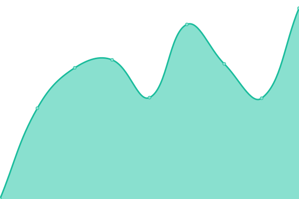

# [📈 Live Status](https://status.orfeo-toolbox.org/): <!--live status--> **🟧 Partial outage**

This repository contains the open-source uptime monitor and status page for [Orfeo Toolbox](http://www.orfeo-toolbox.org), powered by [Upptime](https://github.com/upptime/upptime).

With [Upptime](https://upptime.js.org), you can get your own unlimited and free uptime monitor and status page, powered entirely by a GitHub repository. We use [Issues](https://github.com/orfeotoolbox/status-page/issues) as incident reports, [Actions](https://github.com/orfeotoolbox/status-page/actions) as uptime monitors, and [Pages](https://status.orfeo-toolbox.org/) for the status page.

<!--start: status pages-->
<!-- This summary is generated by Upptime (https://github.com/upptime/upptime) -->
<!-- Do not edit this manually, your changes will be overwritten -->
<!-- prettier-ignore -->
| URL | Status | History | Response Time | Uptime |
| --- | ------ | ------- | ------------- | ------ |
|  [Forge](https://gitlab.orfeo-toolbox.org) | 🟩 Up | [forge.yml](https://github.com/orfeotoolbox/status-page/commits/HEAD/history/forge.yml) | 

 1547ms
     
 | 

<a href="https://status.orfeo-toolbox.org/history/forge">100.00%</a>
    

|  [Forum](https://forum.orfeo-toolbox.org) | 🟩 Up | [forum.yml](https://github.com/orfeotoolbox/status-page/commits/HEAD/history/forum.yml) | 

 1232ms
     
 | 

<a href="https://status.orfeo-toolbox.org/history/forum">99.73%</a>
    

|  [Website](https://www.orfeo-toolbox.org) | 🟩 Up | [website.yml](https://github.com/orfeotoolbox/status-page/commits/HEAD/history/website.yml) | 

 954ms
     
 | 

<a href="https://status.orfeo-toolbox.org/history/website">99.73%</a>
    

|  [Cdash](https://cdash.orfeo-toolbox.org) | 🟥 Down | [cdash.yml](https://github.com/orfeotoolbox/status-page/commits/HEAD/history/cdash.yml) | 

 1207ms
     
 | 

<a href="https://status.orfeo-toolbox.org/history/cdash">48.08%</a>
    

|  [Code Quality Analysis](https://sonar.orfeo-toolbox.org) | 🟩 Up | [code-quality-analysis.yml](https://github.com/orfeotoolbox/status-page/commits/HEAD/history/code-quality-analysis.yml) | 

 949ms
     
 | 

<a href="https://status.orfeo-toolbox.org/history/code-quality-analysis">100.00%</a>
    

<!--end: status pages-->

[**Visit our status website →**](https://status.orfeo-toolbox.org/)

## 📄 License

- Powered by: [Upptime](https://github.com/upptime/upptime)
- Code: [MIT](./LICENSE) © [Orfeo Toolbox](http://www.orfeo-toolbox.org)
- Data in the `./history` directory: [Open Database License](https://opendatacommons.org/licenses/odbl/1-0/)
